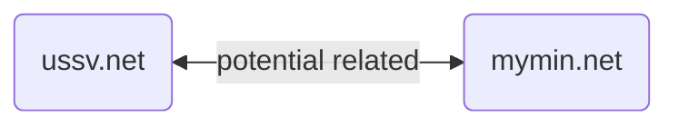

# Overview

I was tasked to investigate a Vietnamese person that was doing MMO and accidencly cause damage to some people. I was given a domain and nothing more, these are the question that I need to anwser:

1. What is the Google Analytics ID of this website?
2. What is the origin hosting IP address of the website?
3. What did the website’s owner claim as the reason the website closed forever
4. This website used to have an alternative login method. What was the login
method and the application ID associated with it?
5. Identify a potential admin of the website or the related community

The domain is: `mymin.net`

# My Investigation 

## Gather basic information

I was given only the domain so it is my first pivoting point, first you have to know what kind of information you can have from the domain name: `mymin.net`, you can know it by reading [Pivot Atlas](https://gopivot.ing/), for the domain: 

 ```mermaid 
 flowchart LR
	%% define nodes
	IP_ADDRESS(IP Address)
	DOMAIN(Domain):::primary
	DOMAIN_(Domain):::secondary
	TLS_CERT(TLS Certificate)
	SAMPLE(Sample)
	
	%% define edges
	DOMAIN -- forward DNS --> IP_ADDRESS
	IP_ADDRESS -- reverse DNS ---> DOMAIN
	DOMAIN <-- DNS history --> IP_ADDRESS
	TLS_CERT -- CN ---> DOMAIN
	DOMAIN <-- similar name ---> DOMAIN_
	DOMAIN <-- registrant ---> DOMAIN_
	DOMAIN <-- registrar --> DOMAIN_
	DOMAIN <-- NS --> DOMAIN_
	DOMAIN <-- TLD --> DOMAIN_
	DOMAIN <-- reg. time --> DOMAIN_
	DOMAIN <-- URL path --> DOMAIN_
	SAMPLE -- references ---> DOMAIN
	SAMPLE -- queries --> DOMAIN
```
Refs: [Pivot Atlas](https://gopivot.ing/)


We will be using (this is the tool I prefer) you guys can check this out [Pivot Atlas Tools](https://gopivot.ing/tools/) 
- nslookup
- [Whois](https://who.is/)
- [DNS Checker](https://dnschecker.org)
- [Web Archive](https://web.archive.org/)
- Censys
- Shodan
- Google Search

For faster time to gather this information, you should have a script to automate this porcess for you, which we do use during our investigation but for the sake of clarity we will be doing manual for this case.

### Domain Information

By using who.is: [mymin.net](https://who.is/whois/mymin.net)

| Registrant Contact Information:        | Administrative Contact Information     | Technical Contact Information          |
| :------------------------------------- | :------------------------------------- | :------------------------------------- |
| Name: None                               | Name: Hau Nguyen                        | Name: Hau Nguyen                             |
| Organization: None                      | Organization: None                      | Organization: None                      |
| Address 342A LE HONG PHONG - NHA TRANG | Address 342A LE HONG PHONG - NHA TRANG | Address 342A LE HONG PHONG - NHA TRANG |
| City Nha Trang                         | City Nha Trang                         | City Nha Trang                         |
| State / Province 34                    | State / Province 34                    | State / Province 34                    |
| Postal Code 718609                     | Postal Code 718609                     | Postal Code 718609                     |
| Country VN                             | Country VN                             | Country VN                             |
| Phone 1206020905                       | Phone 1206020905                       | Phone 1206020905                       |
| Email  ilgbt.net@gmail.com             | Email  ilgbt.net@gmail.com             | Email  ilgbt.net@gmail.com             |
|                                        |                                        |                                        |


| Date Time                |
| :----------------------- |
| Expires On 2025-12-27    |
| Registered On 2019-12-27 |
| Updated On 2024-02-08    |


From this information we have more information to pivoting from:
- Email: ilgbt.net@gmail.com
- Name: Hau Nguyen
- Geolocation: 342A LE HONG PHONG - NHA TRANG


> In this specific case we know that we easily found the Registrat email, name and geolocation but in most case this information probably will be redacted -> which make the case a little bit more challenging
{: .prompt-info }


### IP Address / Name Server / TLS Certificate

This is easy but finding the true IP Address of the domain will take more time, because some domain will sit behind cloudflare or some reverse proxy.

By using **who.is**: https://who.is/whois/mymin.net  there are tab DNS records which has all the information such as 

- A records (which is IPv4)
- Name server 

| Hostname  | Type | Content                |
| :-------- | :--- | :--------------------- |
| mymin.net | NS   | lily.ns.cloudflare.com |
| mymin.net | NS   | tom.ns.cloudflare.com  |
| mymin.net | A    | 104.26.3.89            |
| mymin.net | A    | 104.26.2.89            |
| mymin.net | A    | 172.67.75.81           |

By using VirusTotal I found TLS Cert and even more information on the domain: [VirusTotal
s Information](https://www.virustotal.com/gui/domain/mymin.net/details) -> if you scroll down you will also find the `45.32.121.177` which is `mymin.net` true IP address. 

We verify this information by using **Censys** and **Shodan** to check whether this IP actually host the mymin.net website https://45.32.121.177/account/login.php -> is the mymin.net login portal

- Censys query: [Censys - 45.32.121.177](https://search.censys.io/hosts/45.32.121.177)
- Shodan: [Shodan - 45.32.121.177](https://www.shodan.io/host/45.32.121.177)

> By using Censys and Shodan, we understand mymin.net infastructure, hosted on vultr and has another hostname `ussv.net`
{: .prompt-info }


Later I'll show you how to find the true IP address behind cloudflare using another technique which I find that it is very fundamental and can be apply to any case.

Alright after we have such information such as:

- IP Address: 45.32.121.177

### Examinate the website 

> Remember keep a good OPSEC, use a VM and use a VPN or change your User-Agent or using a Proxy, to examinate the Website because all your action will leave digital footprints so in order to keep yourself safe.
{: .prompt-info }

#### Gather information from mymin.net

Alright we will start examinate the website by take a look at `mymin.net`, we will inspect the login screen and look for any pivoting point. Because we still need at much information as posible

Using Chrome DevTools to inspect all the element to find the Google analytics ID

> Google Analytic ID usually is written as UA-XXXXXXXX or GA-XXXXXX (The lastest Google analytics 4) Refs the different between it [UA to GA4](https://support.google.com/analytics/answer/10269537?hl=en)
{: .prompt-info }


Inspect and search for the `UA-` or `GA-` (Because in order for Google analytics to work, it will scan your website for such code), if you have adblock extention, you should disable it because it will remove the Google analytics from the website


Google analytics Code from the mymin.net:


Using [Web Archive](https://web.archive.org/) to check the historial data of `mymin.net` for any clues. 


There are 29 times where web archive take a snapshot of this webpage, we will check it all the see if are there any interesting stuffs


From 2021 - 2024 this domain is puting to use to serve as as MMO login page, before that 2004-2016 this domain is belong to some Korean Highschool which is not interesting to us.

But when we poking arround the function and review all the link of this webstie we found a lot of interesting stuff

When we click on this USSV policies, its redirect us to another domain which call `mcare.me` where we found even more keywords and information.


#### Gather information from mcare.me

`mcare.me` footer give us a lot of information and keywords (facebook, email address, another domain to look for)


We also using Web Archive one more time to analyze the `mcare.me` for more information


Here is the summary of what we has found (include keywords and findings):
- USSV (on Register page there are a mention of USSV)
- Ucoin
- mcare.me 
- www.ussv.net (from contact)
- 2014 is timestamp when USSV was created
- Facebook: [ussvtools](https://www.facebook.com/ussvtools)
- Google UA ID: `UA-58475948-1`

In the web archive for the mymin.net, there is a capture that shows the [web archive that show relation between ussv.net and mymin.net](https://web.archive.org/web/20201028194133/https://mymin.net/account/login.php)


With the same domain but a different footer (name 2020 USSV)



#### Gather information from www.ussv.net

By using Web Archive to take a look around at `www.ussv.net` and its web archive, there are numerous of snapshot show `nguyehauq` at the "Người giới thiệu" field which give us more clues about who is the owner of these websites.


There's also a Facebook login feature that uses OAuth. I've obtained the client ID (1690686991192609), but I'm unsure if it will be helpful in this case.

Using SpyOnWeb on the domain `www.ussv.net` we found that the USSV.net using the same Google Analytic ID: `UA-58475948-1` also other Google Analytic ID: `UA-2201473`

## Pivoting and correlation from the information that we gathered

These are the summary of infomation that we has found:

- Email: `ilgbt.net@gmail.com`
- Name: `Hau Nguyen`
- Username: `nguyenhauq`
- Geolocation: `342A LE HONG PHONG - NHA TRANG`
- IP Address: `45.32.121.177`
- Domain: `mymin.net`, `mcare.me`, `www.ussv.net`, 
- Keywords: `USSV`, `Ucoin`, 
- Facebook:  [ussvtools](https://www.facebook.com/ussvtools)
- Google UA ID: `UA-58475948-1`
- TLS Cert

That's a lot of information, but now we going to see how these information related to each other and find the owner of mymin.net

> The investigative process is not always straightforward. We may need to revisit data multiple times to uncover crucial details or keywords that were initially overlooked
{: .prompt-info }

We got an email: `ilgbt.net@gmail.com` and a username `nguyenhauq`

This is the most important information in my opinion, you got an email you literaly have the identiy of the person, you can search the email address through multiple database such as:
- Information Stealer database (Using commercial database or you crawl your self [Information Stealer](https://0xdefh.github.io/posts/Stealer-logs/))
- Google Dork the the email on various platform or using tool to automate this process
- Data Breached Database  (you have to crawl it yourself because commercial tool is expensive)

Our checklist are:
- Dork (google, facebook, twitter, forums,...) 
- Search information stealer
- Search data leaked / breached
- Chat mentioned

We start dorking for `ilgbt.net@gmail.com` -> there is only one result 


Which it is a [youtube video](https://www.youtube.com/watch?v=XWTdndQ6Vf8) from 10 years ago from "[Cộng Đồng ILNhaTrang](https://www.youtube.com/@AdminFriendlyUSS)" (Full URL: https://www.youtube.com/@AdminFriendlyUSS) Joined Mar 2 2012, this youtube channel contains these keywords which match with the previous information that we gathered:
- USS
- USSV
- Hau Nguyen

By crawling all data from the youtube description, transcript and search against the information we gathered will result more information (which it is to long to listed here, I'll only listed result that matter the most)

From these youtube we even found more keywords and information that I'll save for further investigation:
- `ILGBT.net`
- `cityuss.net`
- `lgbtuss.com`
- `Auto STR`
- `FastDo`
- `www.ukesemeseke.com`

Our search using the keywords yielded even more information. Notably, `www.ukesemeseke.com` contained a wealth of relevant details on Hau Nguyen and LGBT USS, both of which are currently of interest. 

We found `Hướng Dẫn Cách Gỡ Like, Autotag, AutoCM Facebook by Hậu` on the `Cộng Đồng ILNhaTrang` was a result from searching `www.ukesemeseke.com` -> contain a Facebook Account in the video


The Facebook account is https://www.facebook.com/hau.nguyen.5494, the id seem has already changed so I try web archive: [Hau Nguyen Facebook WebArchive Snapshot](https://web.archive.org/web/20151030093949/https://www.facebook.com/hau.nguyen.5494)


Dorking for specific `nguyenhauq` by using Google show 10 results on Google Search.

or you can use other tools to find username such as [Whatsmyname](https://whatsmyname.app), [Sherlock](https://github.com/sherlock-project/sherlock), and many more, I like tools but I don't know how to use it rather I like a good old WebArchive and Google Dorking


Some of the result is related to the youtube we found above `Cộng Đồng ILNhaTrang` and others are about programming forum. 

Here are link analysis diagram for better visualization (I haven't found a way to mermaid look like Maltego chart so here is a sample of it):

```mermaid
    flowchart LR
    %% define nodes
    USSV(ussv.net)
    MYMIN(mymin.net)
    MCARE(mcare.me)
    HAUNGUYEN(Hau Nguyen)
    HAUNGUYENFB(https://www.facebook.com/hau.nguyen.5494)
    DOMAIN(ilgbt.net@gmail.com)
    IPADDRESS(45.32.121.177)
    YOUTUBE(Cộng Đồng ILNhaTrang)
    GOOGLAANLYTIC(UA-58475948-1)
    NHATRANG(Nha Trang)
    USERNAME(nguyenhauq)
    UKESEME(www.ukesemeseke.com)
    LGBTNET(ILGBT.net)
    CITYUSSNET(cityuss.net)
    LGBTUSSCOM(lgbtuss.com)
    %% define edges
    MYMIN --> USSV
    MYMIN --> MCARE
    MYMIN --> IPADDRESS
    MYMIN -- using --> GOOGLAANLYTIC
    MYMIN --> NHATRANG
    MYMIN --> DOMAIN
    MYMIN <--> HAUNGUYEN
    DOMAIN --> YOUTUBE
    IPADDRESS --> GOOGLAANLYTIC
    YOUTUBE --> NHATRANG
    YOUTUBE --> USSV
    YOUTUBE --> HAUNGUYEN
    YOUTUBE --> UKESEME
    YOUTUBE --> LGBTNET
    YOUTUBE --> CITYUSSNET
    YOUTUBE --> LGBTUSSCOM
    UKESEME --> HAUNGUYEN
    UKESEME --> HAUNGUYENFB
    HAUNGUYEN --> USSV
    HAUNGUYEN --> MCARE
    HAUNGUYENFB --> HAUNGUYEN
    USSV <-- using --> GOOGLAANLYTIC
    USSV --> USERNAME
    USERNAME --> HAUNGUYEN
```


## Conclusion & The Gap in our Analyst & Report

We know, we should have show a link analysis diagram, but we don't have the bugdet to 

1. What is the Google Analytics ID of this website? -> `UA-58475948-1`
2. What is the origin hosting IP address of the website? -> `45.32.121.177`
3. What did the website’s owner claim as the reason the website closed forever -> ``
4. This website used to have an alternative login method. What was the login 
method and the application ID associated with it? ->
5. Identify a potential admin of the website or the related community -> 

### The Gap in our Analysis

For every intelligence analysis there will be a gap in the analysis, aware of those gap help us

### Report 