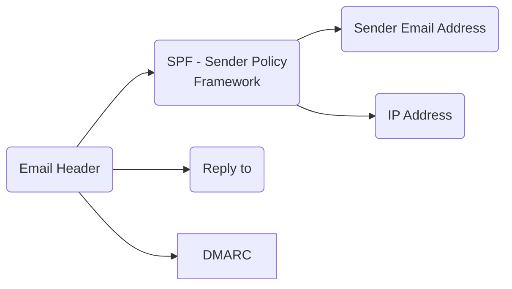

# Overview

I was tasked to background checking for this email which is trying to black mail the user, phishing and these type of blackmail campain are not so familiar with end user, so a few people panic and then start sending the blackmailer what are they asking for which is money

Here are the question that the customer ask me to investigate, which is very vague but that's my job to make clear and understand the requirement of the customer:

- Does this email is true?
- Does my phone or devices is compromised?
- Am I safe? 

The artifact I was given were:
- `A black mail email`
- `A PDF contain black mail information` 

# My investigation

## Understand The Requirment 

When the customer approach me, their question was very emotional and it is very hard for you to understand what are they 

## Gathering Information

I know this step is very tedius and sometime boring but when you understand what kind of informationt that you can extract from the artifact,but I think in the future the AI will soon replace us when doing this task, we just verify these information is correct or not.  

### Checking Email Headers

From the email header we can extract useful information such as:
- SPF
- DKIM
- DMARC 



The Email Header: 

```txt
Delivered-To: [REDACTED]@gmail.com
Received: by 2002:a05:7412:b715:b0:10c:5230:32a5 with SMTP id iu21csp1474233rdb;
        Mon, 9 Sep 2024 04:48:14 -0700 (PDT)
X-Received: by 2002:a05:6214:5506:b0:6c3:6dab:785b with SMTP id 6a1803df08f44-6c532ad6d47mr108794006d6.13.1725882493912;
        Mon, 09 Sep 2024 04:48:13 -0700 (PDT)
ARC-Seal: i=1; a=rsa-sha256; t=1725882493; cv=none;
        d=google.com; s=arc-20160816;
        b=JNYBpSrps1FdI9kc3VX7FB/xeeFKWNrMO/3/fJpts1TRyok6Xy6/ufjQzuY7qOSrCx
         f+c5Rd06v7UVPGCDGPr/XtnTTzdU6gbfDYC6llu73HMUlw9fk/jSnzbmN/Z7W0kYQ+74
         LTEGBZga2/DRezLrK/riI14eMj5PUbPkgjSVaOFACZBTo5MDKwig834U729JVmh419+a
         AFdtv984+wS4bEzSQK7w7Sz6PPTXEYxUIGywCNuF8bhU6yybGx/rUhltIHHd6a8791s8
         NxxuONWt8yMAcPtS/j7+PvQL+B1lF0M0CLDHncsVpBL1Q4AbgavqaZtD29lVK1yjOWSO
         gJSw==
ARC-Message-Signature: i=1; a=rsa-sha256; c=relaxed/relaxed; d=google.com; s=arc-20160816;
        h=to:subject:message-id:date:from:mime-version:dkim-signature;
        bh=aPgyLc98AmsG8N97pGrBRhyBCudm7bz0YFqS+TJlMMk=;
        fh=OecXTaJpN2bCYbdyEn6H4hWAnCtAxTYmW4iOG5blZTQ=;
        b=npI0vfdDj2K51qYkyiDz2559xM7VdE773puebxkm/rRC8d+K2EbC191DPh22DrYrWh
         /UFnxF+zmNWxTpFKWb4ddk80mIO0CtUwUe9JvGOIjpW95dSLZ7A7ISxubFM0KEEJKss2
         UI29Df12uvfYsxrZkaX7O6xnQi/JNQ9nepPfuzRt5VVcjM2IyHOkotYX2u+UL5tNa6vh
         +EXPZnZv8+iE34CPFuXvsa+4siNQJyBYHidIb7P+szuI00zDIUZznPlTvZIzW/p4oASz
         Q1AbjXV/CsFp8ADrDLUqPrM1RUG5QF6/LBH9Ot14Mdunl5e5TNWD6JBwEIVq0AM/skBE
         lAhw==;
        dara=google.com
ARC-Authentication-Results: i=1; mx.google.com;
       dkim=pass header.i=@gmail.com header.s=20230601 header.b=jYW8R0+t;
       spf=pass (google.com: domain of alfredoqz8billups@gmail.com designates 209.85.220.41 as permitted sender) smtp.mailfrom=alfredoqz8billups@gmail.com;
       dmarc=pass (p=NONE sp=QUARANTINE dis=NONE) header.from=gmail.com;
       dara=pass header.i=@gmail.com
Return-Path: <alfredoqz8billups@gmail.com>
Received: from mail-sor-f41.google.com (mail-sor-f41.google.com. [209.85.220.41])
        by mx.google.com with SMTPS id 6a1803df08f44-6c53433ccd5sor34231796d6.1.2024.09.09.04.48.13
        for <[REDACTED]@gmail.com>
        (Google Transport Security);
        Mon, 09 Sep 2024 04:48:13 -0700 (PDT)
Received-SPF: pass (google.com: domain of alfredoqz8billups@gmail.com designates 209.85.220.41 as permitted sender) client-ip=209.85.220.41;
Authentication-Results: mx.google.com;
       dkim=pass header.i=@gmail.com header.s=20230601 header.b=jYW8R0+t;
       spf=pass (google.com: domain of alfredoqz8billups@gmail.com designates 209.85.220.41 as permitted sender) smtp.mailfrom=alfredoqz8billups@gmail.com;
       dmarc=pass (p=NONE sp=QUARANTINE dis=NONE) header.from=gmail.com;
       dara=pass header.i=@gmail.com
DKIM-Signature: v=1; a=rsa-sha256; c=relaxed/relaxed;
        d=gmail.com; s=20230601; t=1725882493; x=1726487293; dara=google.com;
        h=to:subject:message-id:date:from:mime-version:from:to:cc:subject
         :date:message-id:reply-to;
        bh=aPgyLc98AmsG8N97pGrBRhyBCudm7bz0YFqS+TJlMMk=;
        b=jYW8R0+tQt4Ndc26TBAPT4qpGgLH64HOzVfsrD02hQyCCJzKSsAMyspihuzkFc19Ei
         Dc+3N8VvGj0IT8O22lSzG/FosDSeq+ub9FTRiZ9NCfVObRF5GZqyxzammuELyCCqdYe7
         3+/6nOd4SZc1Q//v6K5gPZRH3x6L5fExATZLyfdyLcZM/hpUqIohjs7f5bC0Pj8wFonx
         vH0HQTACLptchvRPBJI/wOn+bxeLBpFxs5YIUqDu865uY6K1d+Fc9bgcwwZTUoy0z9UM
         brrvtGcyghYuYqIQME+45OgPc/fcCp64uIU6awULGGDHrAHE8cr7s6WXsa/hHAutfyjA
         htfA==
X-Google-DKIM-Signature: v=1; a=rsa-sha256; c=relaxed/relaxed;
        d=1e100.net; s=20230601; t=1725882493; x=1726487293;
        h=to:subject:message-id:date:from:mime-version:x-gm-message-state
         :from:to:cc:subject:date:message-id:reply-to;
        bh=aPgyLc98AmsG8N97pGrBRhyBCudm7bz0YFqS+TJlMMk=;
        b=D64gvtMFGqblGJ0wBZFBIfC0VIxIbLSofvF1M8jNJAwDEjvS+eRJ8ccP7l1MF+qi2X
         hxdH7lYJUP+hLpS4gfkNDaUSof2Z5l5tRXE3QpMuCYQ40d4KzMoL2EQkbDwPH4R1+KWY
         bPYeXm0Gfo+/ZM3y44LE/JdXvGcmtbSPYbw3dlA6WlKH1wFQnICZsw37NZS/cxVs+Exn
         m4pqy7GcvzJ6npQHmEBEdx3VaU6zd5zvBYqrtSAPIQr9iH4IoKHrt5OL2pWuvO8Ws7/p
         /dUI90IJRcLiCGWQ4W0DodnaQ/oGuiWgIRTpQxHxjRlzCHVKsdfyKSvz9tUGeeiI7T+E
         tmyg==
X-Gm-Message-State: AOJu0YziktdqAegA7iX0/ZJhHbsmMSZM9WdBLQ8AFOKb8MY7deqCYeds exvYw/l9cmZFUmmi/Cd9Lzry2SlNAjORfRjLnaS2h+7VZ3NIXxrkbRhEBGGaIypA5y66EsE3cGb QTX19gOdr1igyJPHxsMfPE3CXwf0+pj7OVXyKDSDn
X-Google-Smtp-Source: AGHT+IG56kLxou2hFkrSey0nDlysKhUWcXI6uzpnYBxfLJGPjghN1EJBjUEreUp9lC7yEnQQoBlHt+4iYX3Iba2HC10=
X-Received: by 2002:a05:6902:2787:b0:e13:ceaa:59d9 with SMTP id 3f1490d57ef6-e1d349cf0b1mr7827737276.41.1725882481976; Mon, 09 Sep 2024 04:48:01 -0700 (PDT)
MIME-Version: 1.0
Received: by 2002:a05:7108:50c8:b0:3b9:5f76:e115 with HTTP; Mon, 9 Sep 2024 04:48:01 -0700 (PDT)
From: Alfredo Billups <alfredoqz8billups@gmail.com>
Date: Mon, 9 Sep 2024 04:48:01 -0700
Message-ID: <CALBkVrFgRbkVkWzGeikrcYRpCxhsP_iScHJEi6t9xLrrkLV-Xg@mail.gmail.com>
Subject: [REDACTED Customer Name]
To: [REDACTED]@gmail.com
Content-Type: multipart/mixed; boundary="00000000000043994d0621ae54f1"

--00000000000043994d0621ae54f1
Content-Type: multipart/alternative; boundary="00000000000043994c0621ae54ef"

--00000000000043994c0621ae54ef
Content-Type: text/plain; charset="UTF-8"

[REDACTED Customer Name]
[REDACTED Customer Address]

[REDACTED Customer Address]
[REDACTED Customer Phone Number]

--00000000000043994c0621ae54ef
Content-Type: text/html; charset="UTF-8"

[REDACTED Customer Name]br> [REDACTED Customer Address]<br><br>[REDACTED Customer Address]<br>(253) 205-4342

--00000000000043994c0621ae54ef--
--00000000000043994d0621ae54f1
Content-Type: application/pdf; name="[REACTED Customer Name].pdf"
Content-Disposition: attachment; filename="[REACTED Customer Name].pdf"
Content-Transfer-Encoding: base64
X-Attachment-Id: 2bf1f08016d30c40_0.1


--00000000000043994d0621ae54f1--
```

Here are the artifact that we gather from the Email Metadata:
- IP Address: `209.85.220.41` 
- Sender Email Address: `alfredoqz8billups@gmail.com`
- Sender Name: ` Alfredo Billups` 

### Checking the PDF 

Let's take a look at this PDF (I have redacted the customer information from the PDF)


From this PDF I could extract a lot of unique information that could help us pivoting such as:
- `it's peanuts for your tranquility.` 
- `RDP (Remote Control)`
- Metadata from the file (`Producer: Qt 5.5.1` and `Create Date: 2024:09:09 11:47:53`) by using exiftool
- 

### Fomulate Pivoting 

We got all the information that we could have extract from the intial artifacts
