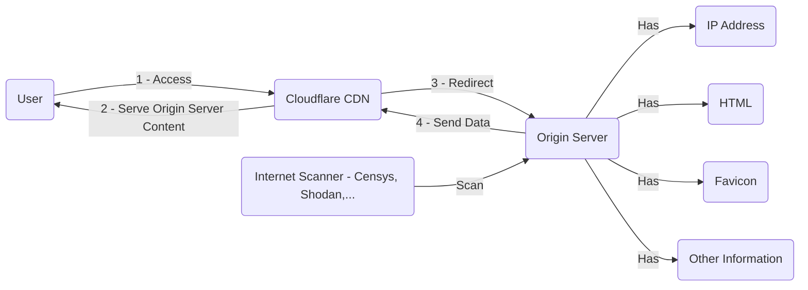

## Oveview

During my day doing OSINT investigation. I has encounter numerous of Website that trying to hide themself with Cloudflare. They think they are safe because their IP address got cloudflare protected.

## The Big Picture and the Fundamental

Internet with its **3,706,452,992 Public IPv4 addresses** is scanned everyday by various services such as Censys, Shodan, Fofa,... and include all the Pentester self-hosted Internet Scanner, all the threat hunter, all the SSH bruteforce attempts, all the Mirai Bot, and many more. So basically, Internet scanning isn't something new. 

Finding a server behind Cloudflare is all about finding something unique about their website that hosted on that server and then hopefully those internet scanner services pick up the server right at the momment the unique thing is there.

Just like you already have all the IP address getting profile and already has all the information you just need a pivoting point to find they needle in the haystack.


> Notes: But still there are some thing you can do to hide your server behind Cloudflare by reading this blog you will see with proper Cloudflare configuration you can securely hide you server
> [How To Bypass Cloudflare and How To Defend by Kerkour](https://kerkour.com/how-to-bypass-cloudflare-and-how-to-defend)
{: .prompt-info }


I'll show you a few way to do it.

This is nothing new and nothing magical about it. Just thank for the services and how the Internet work. 




## Easy: Favicon Hash

**What is Favicon?** Favicon is a logo of the browser tab that you see everyday, this was the first unique thing about the Website because people create their logo, trademarks
and put 

So when identify which server is have that Favicon hash is the easiest way to identify the server behind Cloudflare. Censys and Shodan 

Script to caculate the favicon hash, you win will input the URL of the favicon hash, for example: `python3 script.py www.example.com/favicon.ico`

```python
#!/usr/bin/env python3
import mmh3
import requests
import codecs
import sys
from termcolor import colored
from requests.packages.urllib3.exceptions import InsecureRequestWarning
requests.packages.urllib3.disable_warnings(InsecureRequestWarning)

if len(sys.argv) < 2:
	print("[!] Error!")
	print(f"[-] Use: python3 {sys.argv[0]} http://example.com/favicon.ico")
	sys.exit()

def main():

    try:
        response = requests.get(sys.argv[1], verify=False)
        if (response.status_code != 404):
            favicon = codecs.encode(response.content,"base64")
            hash_favicon = mmh3.hash(favicon)

            print(colored(f'http.favicon.hash:{hash_favicon}', "yellow"))
            print(colored(f'https://www.shodan.io/search?query=http.favicon.hash%3A'+str(hash_favicon), "green"))
            print(colored('http:s//www.censys.io/search/query'))
        else:
            print(colored(f'http.favicon.hash: not found', "red"))

    except Exception as e:
        print(colored(e, "red"))

if __name__ == '__main__':
	main()
```

After you got this information you go to shodan and search.

## Easy: Banner or Title Hash

Same fundamental techniques as the Favicon hash. Banner and Title hash also got index and scan by the these Internet Scanner. In HTML Page, there are always a title and a banner which you can pivoting from


## Medium: TLS Certificate 

You can use TLS Certificate to search for that origin server, why TLS Certificate, what if it use Let's Encrypt and other


## Medium: Using CloudFlair (Which has a lot of script to find the origin server)

You go Censys or Shodan to register an account and then obtain an API key and API secret, and the just start the script and then CloudFlair will run a bunch of script 

The command look like this

```shell
python3 cloudflair.py example.com
```

```javascript
{'hosts': ['X.X.X.X'', 'X.X.X.X', 'X.X.X.X''], 'origins': [('X.X.X.X'', 'Unexpected HTTP status code 404'), ('X.X.X.X'', 'HTML content identical to example.com'), ('X.X.X.X'', 'HTML content identical to example.com')]}
```

## Weird Case: You can use Google Search to find the orogin IP address

In the past, sometimes I just search the domain on Google, which is something just like this: `"example.com"` and then sometimes the IP address appear in the search result. 
 
## Verify IP Address - Domain using Curl

I learn how to use verify the origin server is owner of the domain or not by reading this blog: [Discovering the IP address of a Wordpress site hidden behind Cloudflare](https://blog.nem.ec/2020/01/22/discover-cloudflare-wordpress-ip/)

For a single IP address host a single domain

```shell
curl -k https://ip_address -H "Host: domain_name"
```

For an IP address that server multiple domain (shared IP address) this TTP call [**Server Name Indication (SNI)**](https://www.cloudflare.com/learning/ssl/what-is-sni/) to run multiple **HTTPS** websites on a single IP address. 

`SNI means you can have unique certificates for each domain (i.e. many certificates) while those domains share the same IP. Multi-Domain Certificates, on the other hand, simply use one certificate for many domains, which in return also means one IP for many domains.`

```shell
curl -k --resolve domain:port:ip_address https://<domain name>
```

cURL offers a --resolve argument to explicitly map a domain name and port to an IP address instead of using the traditional DNS lookup. It must include the port and full domain name.

## How can you make it harder for the OSINT guys.

I think you can't, just like your footprint of your C2 or anything of your server will get scan

## Refs

- [How To Bypass Cloudflare and How To Defend by Kerkour](https://kerkour.com/how-to-bypass-cloudflare-and-how-to-defend)
- [How to Bypass Cloudflare in 2024](https://scrapeops.io/web-scraping-playbook/how-to-bypass-cloudflare/)
- [Discovering the IP address of a Wordpress site hidden behind Cloudflare](https://blog.nem.ec/2020/01/22/discover-cloudflare-wordpress-ip/)


