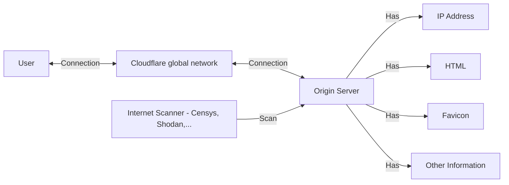

## Oveview

During my day doing OSINT investigation. I has encounter numerous of Website that trying to hide themself with Cloudflare. They think they are safe because their IP address got cloudflare protected.

## The Big Picture and the Fundamental

### Internet Scanner

Internet with its **3,706,452,992 Public IPv4 addresses**, a inite pool of public IP addresses, is constantly scanned by various tools and services. This includes security researchers, threat actors, and automated systems. To identify a server hidden behind Cloudflare, we must find a unique characteristic of its hosted website. This unique identifier can then be used to trigger internet scanners to detect the server's IP address. It's akin to searching for a specific needle in a vast haystack, where we already know the haystack's contents but need a precise starting point.

> Notes: But still there are something you can do to hide your server behind Cloudflare by reading this blog you will see with proper Cloudflare configuration you can securely hide you server
> [How To Bypass Cloudflare and How To Defend by Kerkour](https://kerkour.com/how-to-bypass-cloudflare-and-how-to-defend)
{: .prompt-info }


I'll show you a few way to do it.

This is nothing new and nothing magical about it. Just thank for the services and how the Internet work. 




### Cloudflare DNS Proxy

Here you can find information on how Cloudflare hide you IP address: [Proxied DNS Record](https://developers.cloudflare.com/dns/manage-dns-records/reference/proxied-dns-records/)

`When you proxy specific DNS records through Cloudflare - specifically A, AAAA, or CNAME records — DNS queries for these will resolve to Cloudflare anycast IPs instead of their original DNS target. This means that all requests intended for proxied hostnames will go to Cloudflare first and then be forwarded to your origin server.`


## 1. Favicon Hash

Ever wondered how to identify the server behind Cloudflare's protection? Favicons, those tiny website logos in your browser tabs, hold the key. Websites often use unique favicons, making them a valuable fingerprint for identification.

Here's the trick: by calculating the favicon hash (a unique code derived from the favicon's content), tools like Censys and Shodan can help you locate servers sharing that same favicon. This technique bypasses Cloudflare's masking and reveals the origin server.

```shell
pip3 install requests mmh3 codecs fake-useragent
```

```python
#!/usr/bin/env python3
import mmh3
import requests
import codecs
import sys
from fake_useragent import UserAgent
from requests.packages.urllib3.exceptions import InsecureRequestWarning
requests.packages.urllib3.disable_warnings(InsecureRequestWarning)

def main(favicon_url):

    try:
        headers = {'User-Agent': UserAgent().chrome}
        response = requests.get(favicon_url,headers=headers,verify=False)
        if (response.status_code != 404):
            favicon = codecs.encode(response.content,"base64")
            hash_favicon = mmh3.hash(favicon)
            return {"http.favicon.hash":hash_favicon, "refs":f"https://www.shodan.io/search?query=http.favicon.hash%3A'{hash_favicon}'"}
        return {"http.favicon.hash":None}

    except Exception as e:
        return {"http.favicon.hash":e}

if __name__ == '__main__':
	print(main(sys.argv[1]))
```

Use this information to search for the server on Shodan using its unique favicon.

## 2. Banner or Title Hash

Similar to Favicon hashes, Banner and Title hashes can be indexed and scanned by internet search engines. HTML pages invariably include a title and a banner, providing potential entry points for identification.

For instance, Nginx servers often display a default title. To identify these servers using Censys, you can employ the following query:

```js
services.http.response.html_title: "Welcome to nginx!"
```


## 3. TLS Certificate 

TLS certificates act like digital fingerprints for servers. Each one is unique, making them a powerful tool for identifying the origin server you're looking for. Websites use TLS to secure connections, and tools like crt.sh can reveal past and present certificates associated with a specific domain.

Once you have the TLS certificate fingerprint, you can leverage search engines like Censys, Fofa, ZoomEye, or Shodan. These platforms can identify servers that share the same TLS certificate, potentially leading you to your target.

But the journey doesn't end there. TLS certificates sometimes contain "hardcoded values" - bits of data embedded within the certificate. These values are often reused across different servers, allowing you to pivot your search and potentially discover related systems.

Such as these queries from [Matthew](https://www.embeeresearch.io/)

- `services.tls.certificates.leaf_data.subject_dn`
- `services.tls.certificates.leaf_data.issuer_dn`
- `services.tls.certificates.leaf_data.issuer.common_name`

Here is the blog that I read [A Beginner’s Guide to Tracking Malware Infrastructure](https://censys.com/a-beginners-guide-to-tracking-malware-infrastructure/)

## 4. Historical DNS record

As you now know, Cloudflare functions as a DNS proxy. Sometimes, when a site first appears on the Internet, it may not initially use Cloudflare as its DNS proxy. Therefore, older DNS records could still be present somewhere on the Internet that still point to the origin server (IP address). 

You can use such tool such as [Security Trail](https://securitytrails.com/) to look for historical DNS, they store and crawl all DNS all over the Internet.

> Notes: They may change the original IP address after setting up Cloudflare, so even if you've found a historical IP address that matches the domain, you might still be unable to verify it.
{: .prompt-info }

## 5. Subdomain could point to the Origin Server IP Address

Sometimes the subdomain could point to the origin server ip address. Well in OSINT you has already recon the whole domain by using tool such as dnsreccon,

## 6. Content Security Policy Header Analysis show the Origin Server IP Address

`services.http.response.header.content_security_policy: "example.com"` 

## 7. Medium: Using CloudFlair (Which has a lot of script to find the origin server)

You go Censys or Shodan to register an account and then obtain an API key and API secret, and the just start the script and then CloudFlair will run a bunch of script 

The command look like this

```shell
python3 cloudflair.py example.com
```

The result would look like this

```javascript
{'hosts': ['X.X.X.X', 'X.X.X.X', 'X.X.X.X'], 'origins': [('X.X.X.X', 'Unexpected HTTP status code 404'), ('X.X.X.X', 'HTML content identical to example.com'), ('X.X.X.X', 'HTML content identical to example.com')]}
```

## 8. Weird Case: You can use Google Search to find the orogin IP address

In the past, sometimes I just search the domain on Google, which is something just like this: `"example.com"` and then sometimes the IP address appear in the search result. 
 
## 9. Verify IP Address - Domain using Curl

I learn how to use verify the origin server is owner of the domain or not by reading this blog: [Discovering the IP address of a Wordpress site hidden behind Cloudflare](https://blog.nem.ec/2020/01/22/discover-cloudflare-wordpress-ip/)

For a single IP address host a single domain

```shell
curl -k https://ip_address -H "Host: domain_name"
```

For an IP address that server multiple domain (shared IP address) this TTP call [**Server Name Indication (SNI)**](https://www.cloudflare.com/learning/ssl/what-is-sni/) to run multiple **HTTPS** websites on a single IP address. 

`SNI means you can have unique certificates for each domain (i.e. many certificates) while those domains share the same IP. Multi-Domain Certificates, on the other hand, simply use one certificate for many domains, which in return also means one IP for many domains.`

cURL offers a --resolve argument to explicitly map a domain name and port to an IP address instead of using the traditional DNS lookup. It must include the port and full domain name.

**If the site is still host on that server, it will return the content of the website.**


## Conclusion

Honestly, there are a ton of ways to do anything. It really depends on how creative you are and how well you understand the basics. These tips and tricks have been a huge help for me.


## Refs

- [How To Bypass Cloudflare and How To Defend by Kerkour](https://kerkour.com/how-to-bypass-cloudflare-and-how-to-defend)
- [How to Bypass Cloudflare in 2024](https://scrapeops.io/web-scraping-playbook/how-to-bypass-cloudflare/)
- [Discovering the IP address of a Wordpress site hidden behind Cloudflare](https://blog.nem.ec/2020/01/22/discover-cloudflare-wordpress-ip/)
- [Finding Fraudsters Who Hide Behind Cloudflare](https://www.youtube.com/watch?v=UBZBL65Dv1w)
- [A Beginner’s Guide to Tracking Malware Infrastructure](https://censys.com/a-beginners-guide-to-tracking-malware-infrastructure/)
- [Bypassing Cloudflare WAF with the origin server IP address](https://blog.detectify.com/industry-insights/bypassing-cloudflare-waf-with-the-origin-server-ip-address/)
- []()